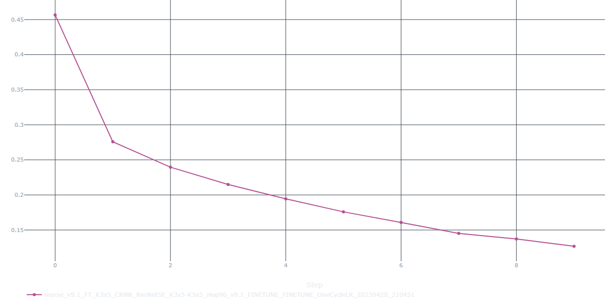
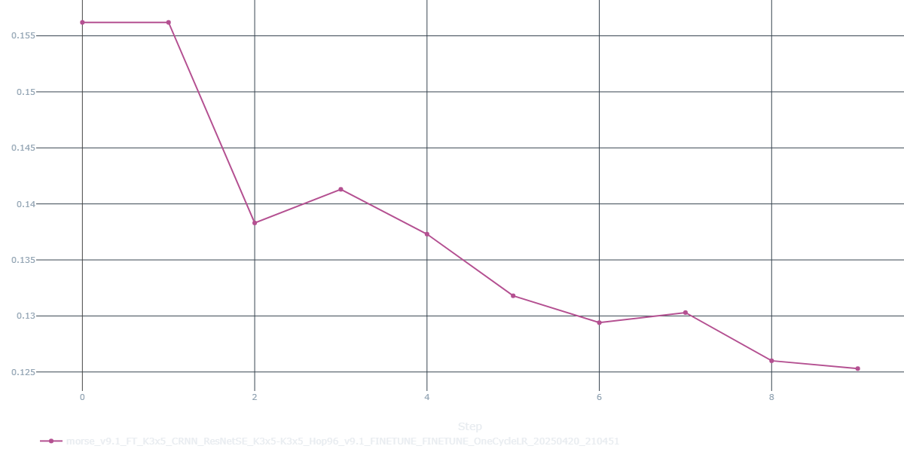
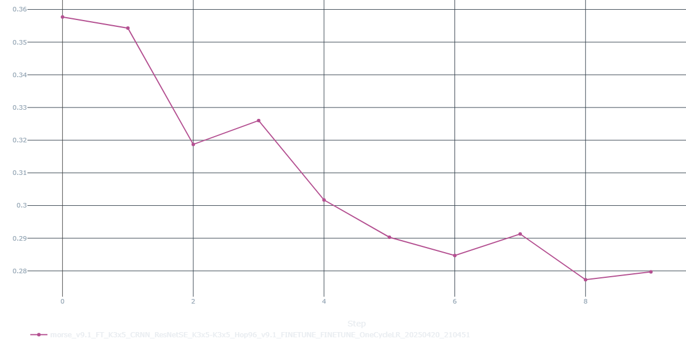
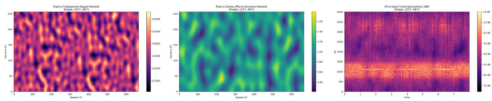

#  Morse Code Recognition from Audio  MorseAudioDecoder 

**Распознавание кода Морзе (Азбуки Морзе) из аудиозаписей с использованием CRNN (Convolutional Recurrent Neural Network) на PyTorch.**

[![Python Version][python-badge]][python-link] [![PyTorch Version][pytorch-badge]][pytorch-link] [![Code style: black][black-badge]][black-link]

[python-badge]: https://img.shields.io/badge/Python-3.9%2B-blue.svg
[python-link]: https://www.python.org/
[pytorch-badge]: https://img.shields.io/badge/PyTorch-1.10%2B-orange.svg
[pytorch-link]: https://pytorch.org/
[black-badge]: https://img.shields.io/badge/code%20style-black-000000.svg
[black-link]: https://github.com/psf/black

Этот проект представляет собой решение для автоматического декодирования сообщений, переданных азбукой Морзе в виде аудиосигналов. Он использует гибридную нейронную сеть, сочетающую сверточные слои (ResNet-SE блоки) для извлечения признаков из спектрограмм и рекуррентные слои (GRU) для обработки временных последовательностей, с последующим CTC Loss для декодирования.

**Цель проекта:** Демонстрация навыков в области обработки аудиосигналов, глубокого обучения (PyTorch), построения пайплайнов машинного обучения и анализа результатов.

---

## Содержание

*   [Ключевые Особенности](#ключевые-особенности-)
*   [Пример Спектрограммы](#пример-спектрограммы-)
*   [Эволюция Модели и Результаты Обучения](#-эволюция-модели-и-результаты-обучения)
*   [Структура Проекта](#структура-проекта-)
*   [Установка](#установка-)
*   [Данные](#данные-)
*   [Использование](#использование-)
    *   [Обучение / Дообучение (Fine-tuning)](#обучение--дообучение-fine-tuning-)
    *   [Ансамблирование и Финальный Submission](#ансамблирование-и-финальный-submission-)
*   [Финальные Результаты](#финальные-результаты-)
*   [Возможные Улучшения](#возможные-улучшения-)

---

## Ключевые Особенности ✨

*   **Гибридная CRNN Архитектура:** Использование ResNet-SE блоков для эффективного извлечения пространственно-временных признаков из спектрограмм и BiGRU для моделирования последовательностей.
*   **CTC Loss:** Применение Connectionist Temporal Classification (CTC) для обучения модели на невыровненных данных (аудио и текст).
*   **Аугментации:** Поддержка различных техник аугментации аудио (на уровне сигнала и спектрограммы) для повышения робастности модели:
    *   Аудио: Gain, GaussianNoise, ClippingDistortion (через `audiomentations`).
    *   Спектрограмма: Perlin Noise, Additive Gaussian Noise, SpecAugment.
*   **Гибкая Конфигурация:** Управление всеми параметрами (пути, гиперпараметры модели, обучение, аугментации) через JSON конфиг (`config/experiment_base.json`).
*   **Воспроизводимость:** Использование `requirements.txt` и фиксированного random seed.
*   **Модульная Структура Кода (`src/`):** Код разделен на логические модули для лучшей читаемости и поддержки.
*   **MLflow Интеграция (Опционально):** Возможность логирования параметров, метрик и артефактов экспериментов.
*   **Ансамблирование:** Ноутбук `UnionSubmissions.ipynb` для объединения предсказаний нескольких моделей методом большинства голосов.

---

## Пример Спектрограммы 🖼️

Визуализация Мел-спектрограммы, которая подается на вход сверточной части модели:

<p align="center">


<br><em>Примеры Мел-спектрограмм аудиозаписей кода Морзе.</em>
</p>

---

## 🚀 Эволюция Модели и Результаты Обучения

Процесс получения финальной модели был итеративным и включал несколько этапов обучения и дообучения (fine-tuning) с постепенным усложнением аугментаций и анализом промежуточных результатов.

### Этап 1: Начальное Обучение Базовой Модели

**Цель:** Обучить базовую CRNN модель на исходных данных с минимальными или без аугментаций, чтобы получить отправную точку.

| Обучение (Train Loss)                        | Валидация (Validation Loss)                    | Валидация (Levenshtein Distance)                |
| :-------------------------------------------: | :---------------------------------------------: | :---------------------------------------------: |
|      |      |  |

**Наблюдения:**
Начальное обучение показало уверенное снижение `Train Loss`. Однако, метрика `Levenshtein Distance` на валидации перестала улучшаться после **11-й эпохи** (достигнув **`0.3133`**), что указывает на начало переобучения модели на тренировочных данных.

**Действие:** Для борьбы с переобучением и дальнейшего улучшения модели был применен этап дообучения (fine-tuning) с использованием расширенного набора стандартных аудио-аугментаций (Gain, GaussianNoise, Clipping).

---

### Этап 2: Дообучение со Стандартными Аугментациями

**Цель:** Повысить обобщающую способность модели и снизить переобучение за счет внесения разнообразных искажений в аудиосигнал на этапе дообучения.

| Обучение (Train Loss)                                | Валидация (Validation Loss)                            | Валидация (Levenshtein Distance)                        |
| :---------------------------------------------------: | :-----------------------------------------------------: | :-----------------------------------------------------: |
|      |      |  |

**Наблюдения:**
На этом этапе удалось значительно улучшить результат, достигнув нового минимума `Levenshtein Distance` **`0.2773`** на **8-й эпохе** дообучения. Графики показывают, что стандартные аугментации помогли сдержать переобучение, хотя кривые потерь на `train` и `validation` все еще сближаются к концу этапа.

**Действие:** В поисках дальнейшего улучшения была разработана и внедрена кастомная аугментация спектрограмм с использованием **шума Перлина**.

---

### Этап 3: Дообучение с Аугментацией Шумом Перлина

**Цель:** Улучшить робастность модели к сложным, нелинейным искажениям спектрограммы, имитируя условия реального мира, с помощью процедурно генерируемого шума Перлина.

**Методика Аугментации:**
Эта техника применяет к спектрограмме две предварительно сгенерированные карты шума Перлина:
1.  **Аддитивная карта:** Добавляет плавный, структурированный шум к значениям спектрограммы.
2.  **Мультипликативная карта:** Умножает значения спектрограммы на коэффициенты, близкие к 1, но варьирующиеся в пространстве и времени, имитируя изменения усиления или затухания сигнала.

<p align="center">
  
  <br><em>Пример Мел-спектрограммы с наложенной аугментацией шумом Перлина.</em>
</p>

| Обучение (Train Loss)                                    | Валидация (Validation Loss)                                | Валидация (Levenshtein Distance)                            |
| :-------------------------------------------------------: | :---------------------------------------------------------: | :---------------------------------------------------------: |
| .png) | .png) | .png) |

**Наблюдения:**
Применение шума Перлина позволило модели сделать еще один шаг вперед и достичь нового лучшего результата на валидации — `Levenshtein Distance` **`0.2637`**. Дальнейшие попытки дообучения в этой конфигурации уже не приводили к значимому улучшению метрики.

**Действие:** Была предпринята попытка финальной "полировки" модели путем короткого дообучения на чистых данных.

---

### Этап 4: Финальная Подстройка на Чистых Данных

**Цель:** Немного скорректировать веса модели, обученной с сильными аугментациями, для оптимальной работы на исходных, "чистых" данных валидационной выборки.

**Наблюдения:**
Дообучение лучшей модели с предыдущего этапа в течение **3 эпох** на чистых данных (без каких-либо аугментаций) позволило немного улучшить результат и достичь итогового лучшего значения `Levenshtein Distance` на валидации: **`0.2607`**.

---

**Итог:** Итеративный подход с последовательным введением и настройкой аугментаций, а также финальной подстройкой позволил существенно улучшить качество модели по сравнению с базовым обучением.

---

## Структура Проекта 📁


```
.
├── .venv/                   # Виртуальное окружение Python
├── config/                  # Конфигурационные файлы
│   └── experiment_base.json # Основной конфиг для MorseAudioDecoder.ipynb
├── data/                    # Данные (не включены в репозиторий)
│   └── raw/
│       ├── train.csv
│       ├── sample_submission.csv
│       └── morse_dataset/
│           └── morse_dataset/ # Папка с аудио файлами (.opus)
├── notebooks/               # Jupyter Notebooks
│   ├── MorseAudioDecoder.ipynb  # Основной пайплайн (обучение, finetune, предсказание)
│   └── UnionSubmissions.ipynb   # Ансамблирование лучших моделей и финальный анализ
├── outputs/                 # Результаты запусков MorseAudioDecoder.ipynb
│   └── [run_name]/          # Папка для конкретного запуска (модели, конфиги)
├── src/                     # Исходный код проекта
│   ├── data_processing/     # Загрузка, обработка данных, аугментации
│   ├── features/            # Извлечение признаков (спектрограммы)
│   ├── inference/           # Генерация предсказаний, декодирование
│   ├── models/              # Определение архитектуры модели (CRNN)
│   ├── training/            # Логика обучения, evaluation, пайплайн
│   └── utils/               # Вспомогательные функции (seed, mlflow, пути)
├── UnionSubmissions/        # Папка с лучшими моделями для ансамбля и результатом
│   ├── [model_score_1]/     # Папка с лучшей моделью и ее конфигом
│   ├── [model_score_2]/
│   │   ...
│   └── ensemble_output_v2/  # Финальный submission от ансамбля
├── .gitignore               # Файл для исключения файлов из Git
├── README.md                # Этот файл
├── requirements.txt         # Зависимости Python
└── LICENSE                  # Текст лицензии (например, MIT) - [Добавьте файл!]
```
---

## Установка ⚙️

1.  **Клонируйте репозиторий:**
    ```bash
    git clone [URL вашего репозитория]
    cd MorseAudioDecoder
    ```

2.  **Создайте и активируйте виртуальное окружение** (рекомендуется):
    *   **Linux/macOS:**
        ```bash
        python3 -m venv .venv
        source .venv/bin/activate
        ```
    *   **Windows (Git Bash / WSL):**
        ```bash
        python -m venv .venv
        source .venv/Scripts/activate
        ```
    *   **Windows (Command Prompt / PowerShell):**
        ```bash
        python -m venv .venv
        .\.venv\Scripts\activate
        ```
      *(Рекомендуется Python версии 3.9)*

3.  **Установите зависимости:**
    ```bash
    pip install -r requirements.txt
    ```
    *(Убедитесь, что у вас установлен `pip`)*

---

## Данные 💾

*   **Источник данных:** `data.zip`
*   **Структура:** Перед запуском скриптов убедитесь, что папка `data/raw/` содержит:
    *   `train.csv`: CSV файл с колонками, как минимум `id` (имя файла без расширения) и `message` (текст Морзе).
    *   `sample_submission.csv`: CSV файл с колонкой `id` для тестовых файлов.
    *   `morse_dataset/morse_dataset/`: Папка, содержащая аудиофайлы в формате `.opus`, имена которых соответствуют `id` из CSV файлов.

*(Данные не включены в этот репозиторий из-за их размера)*.

---

## Использование 🚀

### Обучение / Дообучение (Fine-tuning)

Используйте ноутбук `notebooks/MorseAudioDecoder.ipynb`.

1.  **Настройте `config/experiment_base.json`:**
    *   Установите `"run_mode"` в `"train_only"` для обучения с нуля или `"finetune_only"` для дообучения.
    *   Для `"finetune_only"`: укажите путь к базовой модели в `"finetuning.finetune_only_checkpoint_path"` (относительно корня проекта).
    *   Проверьте и настройте другие параметры (пути, learning rate, эпохи, аугментации и т.д.). Флаг `apply_audio_augmentation` в секции `training` или `finetuning` включает/выключает **все** аугментации для данного этапа.
2.  **Запустите все ячейки ноутбука:** `Kernel -> Restart & Run All`.
3.  **Результаты:**
    *   Обученные модели (`.pth`) и конфигурации сохраняются в папку `outputs/[имя_запуска]/`.
    *   Если обучение прошло успешно, будет сгенерирован файл `submission_[...].csv` в той же папке.
    *   Если MLflow активен, метрики и артефакты будут залогированы.

### Ансамблирование и Финальный Submission

Используйте ноутбук `notebooks/UnionSubmissions.ipynb`.

1.  **Подготовьте лучшие модели:** Скопируйте файлы лучших моделей (`.pth`) и их соответствующие конфигурационные файлы (`.json`) в отдельные папки внутри `UnionSubmissions/` (например, `UnionSubmissions/0.2607/`, `UnionSubmissions/0.2637/` и т.д.). *Важно: убедитесь, что в `.json` файлах моделей указан правильный относительный путь к аудио в `paths.audio_folder_name` (например, `data/raw/morse_dataset/morse_dataset`)*.
2.  **Настройте Ячейку 2 (`Конфигурация Ансамбля`):**
    *   В списке `MODELS_TO_ANALYZE` укажите корректные пути к файлам `.pth` и `.json` для каждой модели, которую вы хотите включить в ансамбль (пути относительно корня проекта).
    *   Установите `RUN_VALIDATION_ANALYSIS = True/False` и `EXTRACT_SECRET_MESSAGE = True/False` по необходимости.
3.  **Запустите все ячейки ноутбука:** `Kernel -> Restart & Run All`.
4.  **Результаты:**
    *   Финальный submission-файл ансамбля (`submission_ensemble_majority.csv`) будет сохранен в папку, указанную в `OUTPUT_ENSEMBLE_DIR` (по умолчанию `UnionSubmissions/ensemble_output_v2/`).
    *   Если `EXTRACT_SECRET_MESSAGE = True`, будет выведено "секретное послание" и его расшифровка методом замены точек/тире.

---

## Финальные Результаты 🏆

*   **Основная Метрика:** Расстояние Левенштейна между предсказанным и реальным текстом.
*   **Лучшая Одиночная Модель (Валидация):** Levenshtein = **`0.2607`**
*   **Финальный Ансамбль (Тест/Kaggle):** Levenshtein = **`0.39848`** *(или укажите актуальное значение, если отличается)*

*(См. графики эволюции обучения в разделе [Эволюция Модели и Результаты Обучения](#-эволюция-модели-и-результаты-обучения))*

---

## Возможные Улучшения 🛠️

*   **Тюнинг Гиперпараметров:** Использование инструментов вроде Optuna или Ray Tune для подбора оптимальных параметров модели и обучения.
*   **Более Продвинутые Архитектуры:** Эксперименты с Transformer-based моделями (например, Wav2Vec2, HuBERT) с адаптацией для задачи Морзе.
*   **Улучшенные Аугментации:** Исследование более специфичных для Морзе или радиосигналов аугментаций.
*   **Прямая Обработка Временного Ряда (Waveform):** Исследование моделей или методов обработки, работающих непосредственно с сырыми аудиоданными (временным рядом), вместо преобразования в спектрограммы. Это может включать 1D сверточные сети, модели типа WaveNet или специфические алгоритмы обнаружения тона/огибающей для Морзе.
*   **Продвинутое Ансамблирование:** Использование взвешенного голосования, стекинга или других методов.
*   **Оптимизация для Инференса:** Квантизация модели, экспорт в ONNX для ускорения предсказаний.

---
